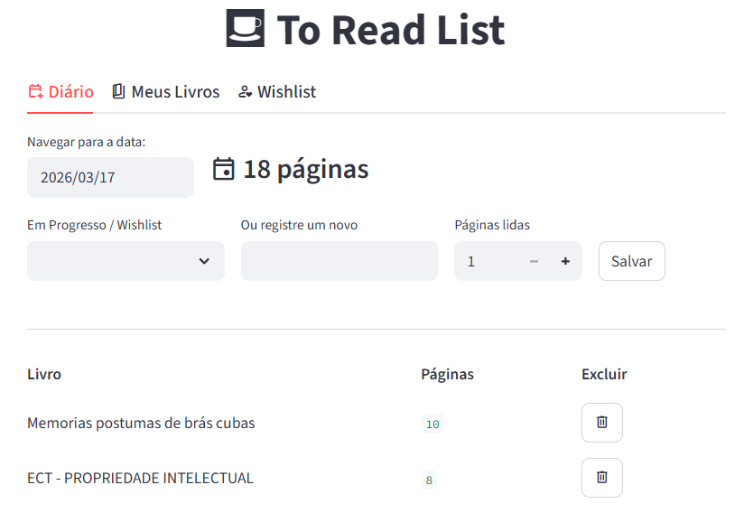
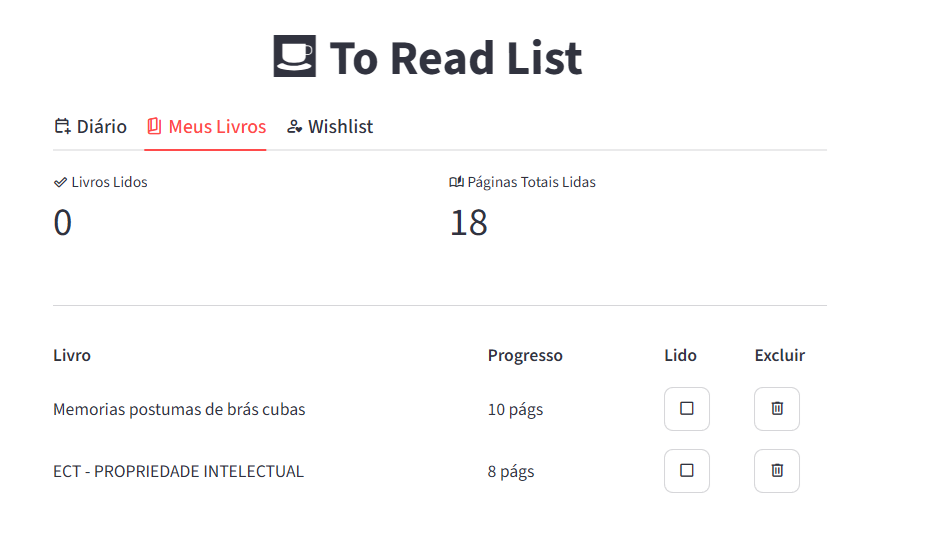
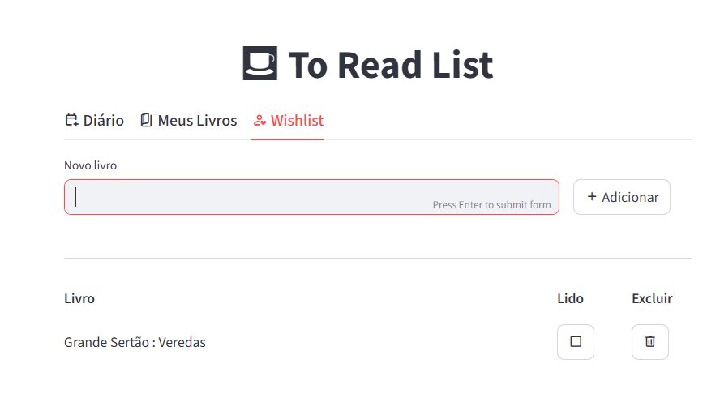

# 📚 To Read List

Um aplicativo web minimalista para registrar o hábito de leitura diário e manter uma lista de desejos de livros para o futuro. Construído com Python e Streamlit.

## ⚙️ Funcionalidades

O sistema é dividido em duas abas principais:
- **Diário:** Permite registrar a data, o nome do material e quantas páginas foram lidas no dia.



- **Wishlist:**  Uma lista simples para adicionar títulos que você deseja ler futuramente.





- **Armazenamento Local:** Todos os registros são salvos automaticamente em arquivos locais (`diario.csv` e `wishlist.csv`) na raiz do projeto.

## 🚀 Como executar o projeto localmente

1. Certifique-se de ter o Python instalado na sua máquina.
2. Abra o terminal na pasta do projeto e instale as dependências necessárias executando:

```bash
pip install -r requirements.txt
```

3. Em seguida, rode o aplicativo com o comando:

```bash
streamlit run app.py
```

4. O sistema abrirá automaticamente no seu navegador padrão.

## 💾 Backup dos Dados

Como o sistema utiliza arquivos `.csv` locais, lembre-se de realizar o *commit* e o *push* (sincronização) regularmente pelo VS Code para que o seu histórico de leitura fique salvo em segurança no GitHub.

---
Desenvolvido por Leonardo Martins Bezerra